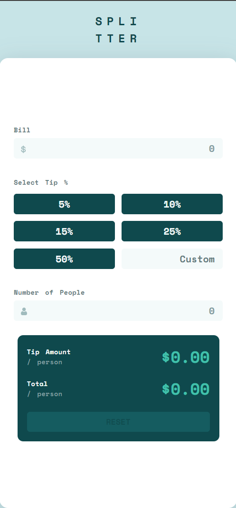

# Frontend Mentor - Tip calculator app solution

This is a solution to the [Tip calculator app challenge on Frontend Mentor](https://www.frontendmentor.io/challenges/tip-calculator-app-ugJNGbJUX). Frontend Mentor challenges help you improve your coding skills by building realistic projects.

## Overview

### The challenge

Users should be able to:

- View the optimal layout for the app depending on their device's screen size
- See hover states for all interactive elements on the page
- Calculate the correct tip and total cost of the bill per person

### Screenshot

### Links

- Solution URL: [Add solution URL here](https://github.com/FixelDev/tip-calculator-main)
- Live Site URL: [Add live site URL here](https://your-live-site-url.com)

## My process

### Built with

- SCSS
- Semantic HTML5 markup
- Flexbox
- CSS Grid
- [React](https://reactjs.org/) - JS library

### What I learned

It was my first project using React, so it was great for learning the basics. I learned about how to create an app using component, states, side effects, conditional rendering etc.

## Author

- Frontend Mentor - [@FixelDev](https://www.frontendmentor.io/profile/FixelDev)
- Twitter - [@FixelDev](https://www.twitter.com/FixelDev)
